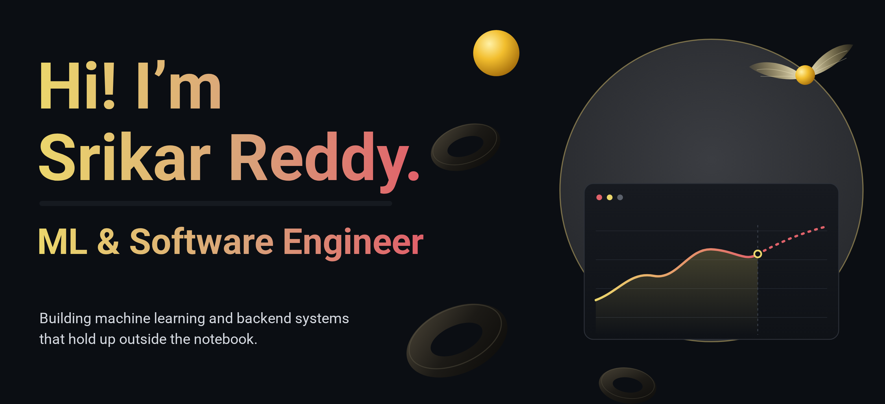

  

  
  
  

  I build machine learning and backend systems, and I measure them honestly. 
  Currently forecasting Arctic sea ice as a Research Intern at NCPOR.

 

<h3 align="center">Featured work</h3>

  
  
  
  

<a href="https://github.com/srikarreddyram?tab=repositories">More projects →</a>

 

<h3 align="center">Tech stack</h3>

  

 

<h3 align="center">Certifications</h3>

  
  
  
  

 

<i>Mischief managed.</i>

